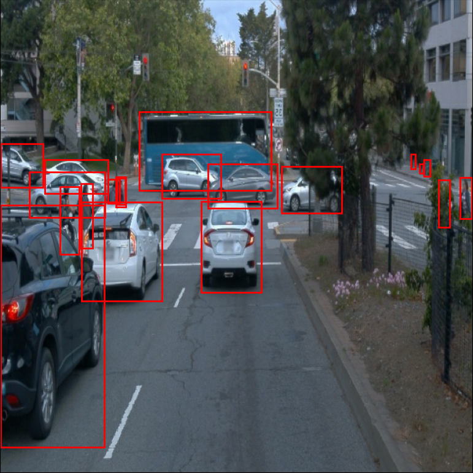
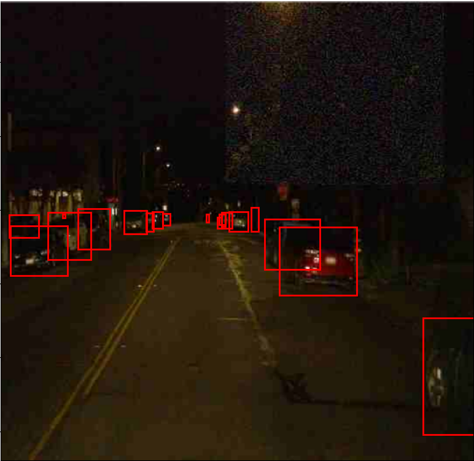
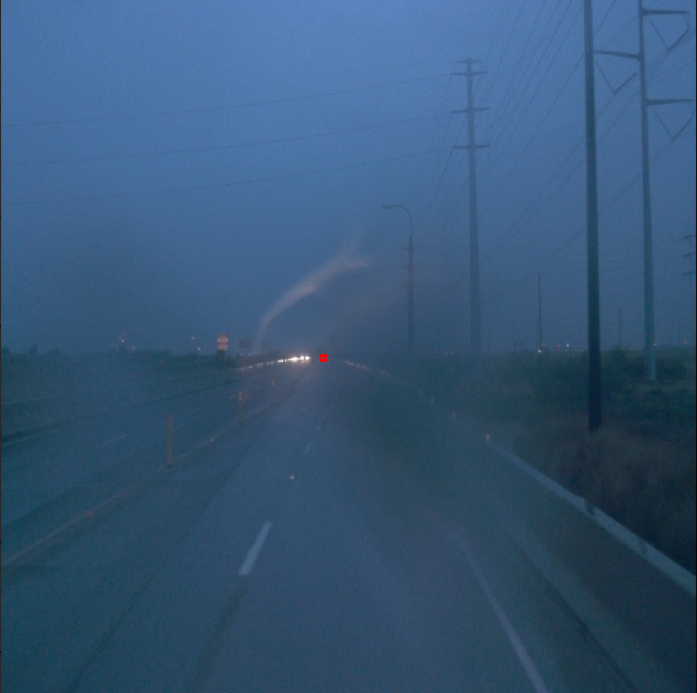
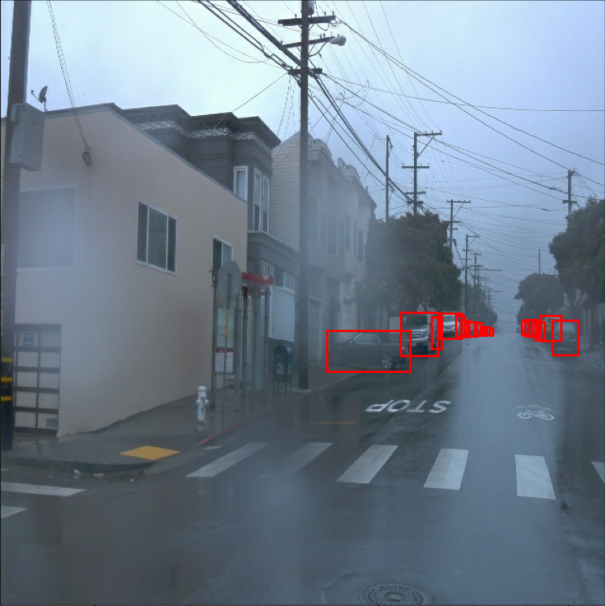
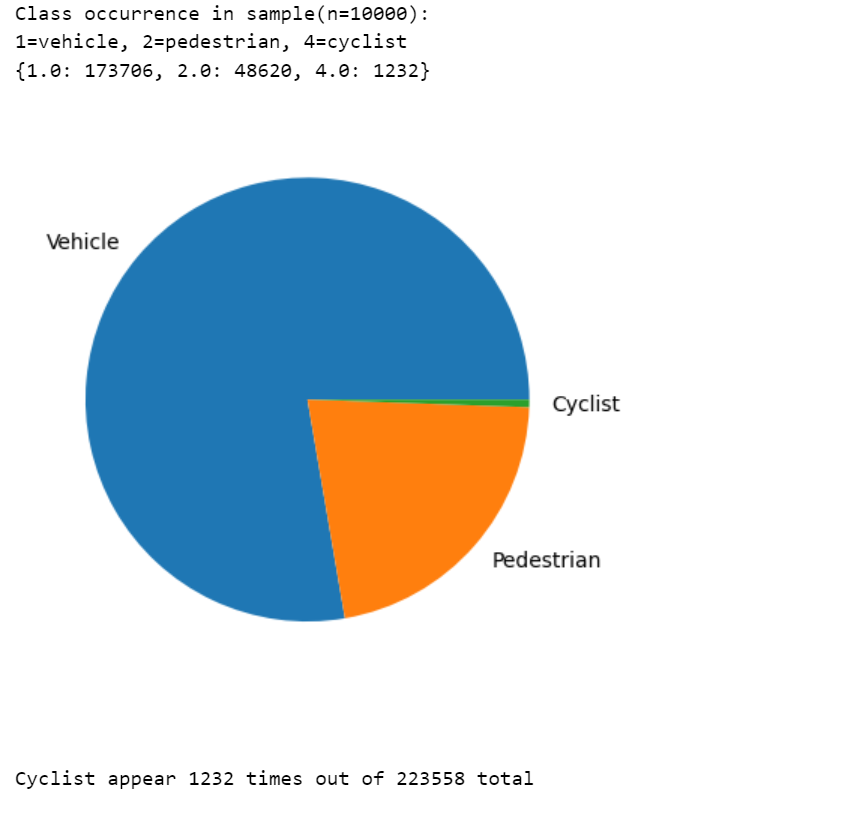
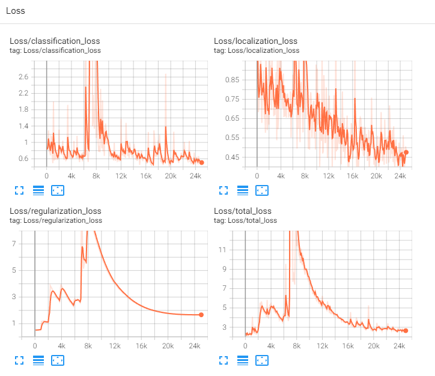
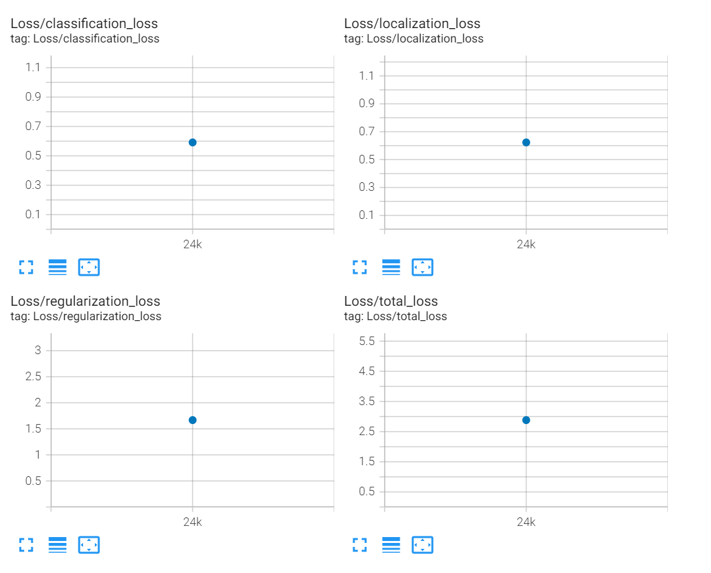
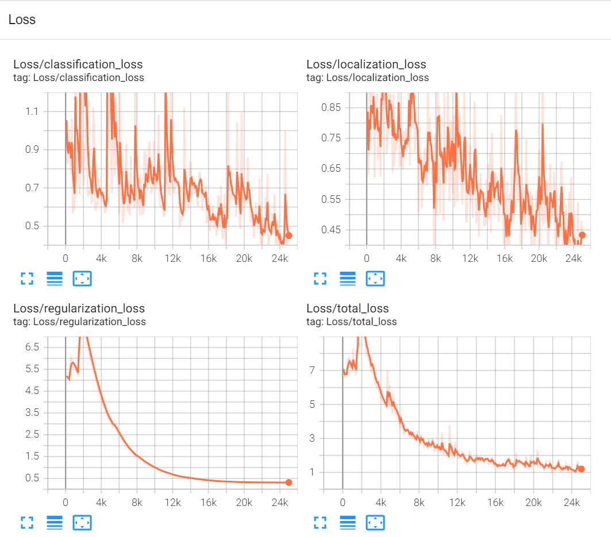
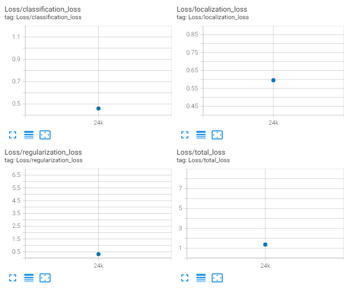

# Project overview

*This README.md is for project repository at https://github.com/irassi/nd013-c1-vision-starter*

Self-driving cars will utilize methods similar to humans in operating a vehicle. They monitor their surroundings with all of their senses, interpret what they see, and make adjustments to the vehicle’s controls in order to maintain smooth and safe driving. In the case of the self-driving systems, the senses are the sensors such as lidars and cameras and interpreting these inputs is vitally important. 

In this project we are looking at how the camera inputs can be used to understand what’s happening in traffic. We are teaching an artificial intelligence model to recognise objects in the images captured by a camera. We feed example data, from Waymo Open Datasets, to train the model and based on the findings of our evaluation we make adjustments to the model to try to reach greater performance.

## Set up
This section should contain a brief description of the steps to follow to run the code for this repository.

The code in this repository is mainly based on the given started materials for the project, and no additional libraries have been added. On the contrary, the waymo-open-dataset python addition proved impossible to install and therefore it is not used currently. 

All data was copied from the virtual machine workspace.

## Dataset
### Dataset analysis
The images in the dataset appeared mostly high quality, with variable weather conditions and time of day. Majority of the images were from optimal daytime conditions and therefore some augmentations were made to the data to see how this affects the models performance. 

  
*Example of a good quality dataset image*

  
*Example of a bad quality dataset image, with additional augmentations layered on top*

Other challenging conditions such as fog and rain:
  

Looking at the classes of the ground truth bounding boxes in the training data, we can see that the images contain mostly cars and pedestrians and very rarely cyclists.

### Cross validation
As I used the data from the workspace, I didn't change the preset training splits. This means that there were
+ 86 datasets for training
+ 3 datasets for testing
+ 10 datasets for evaluation

Training need a lot of data to be successful, whereas with testing quality can beat quantity in terms of getting good test results. The animation below shows how the model performed with the test data, it's clear there were a lot of false positives and it didn't do great in tight groups.

  
*The Improved model in action*

## Training
### Reference experiment
The reference experiment provided fluctuating results during it's run. The losses spiked up heavily at around 7000 but in the end the total loss settled to a little under 3. 

  
*Reference model: loss*

### Evaluation:

The evaluation run set the total loss  to about **2.7**. 

*Reference model: evaluation*

|||||
|---|---|---|---|
| Average Precision  (AP) @[ IoU=0.50:0.95 | area=   all | maxDets=100 ]| = 0.003|
| Average Precision  (AP) @[ IoU=0.50      | area=   all | maxDets=100 ]| = 0.009|
| Average Precision  (AP) @[ IoU=0.75      | area=   all | maxDets=100 ]| = 0.001|
| Average Precision  (AP) @[ IoU=0.50:0.95 | area= small | maxDets=100 ]| = 0.001|
| Average Precision  (AP) @[ IoU=0.50:0.95 | area=medium | maxDets=100 ]| = 0.019|
| Average Precision  (AP) @[ IoU=0.50:0.95 | area= large | maxDets=100 ]| = 0.030|
| Average Recall     (AR) @[ IoU=0.50:0.95 | area=   all | maxDets=  1 ]| = 0.002|
| Average Recall     (AR) @[ IoU=0.50:0.95 | area=   all | maxDets= 10 ]| = 0.009|
| Average Recall     (AR) @[ IoU=0.50:0.95 | area=   all | maxDets=100 ]| = 0.042|
| Average Recall     (AR) @[ IoU=0.50:0.95 | area= small | maxDets=100 ]| = 0.016|
| Average Recall     (AR) @[ IoU=0.50:0.95 | area=medium | maxDets=100 ]| = 0.167|
| Average Recall     (AR) @[ IoU=0.50:0.95 | area= large | maxDets=100 ]| = 0.135|

## Improve on the reference
To improve the performance of the model, I first applied augmentations to the training materials. Since the quality of the training materials was so high, both in terms of image quality and the conditions, I applied a set of variables to randomly decrease the quality. 
These were 
+ **“random crop”** (for different image dimension)
+ **“random patch gaussian”** (to mimic digital artefacts)
+ **“random jpeg quality”** (to decrease detail quality and introduce compression artefacting)
+ **“random adjust saturation”** (to under/over saturate the image. Lower saturation (greyscale) in particular can help mimic nighttime conditions) 

These augmentations had a noticeable effect on the image quality. Examples below. 

  
*Random Patch Gaussian*

  
*Random JPEG Quality*

  
*Random Adjust Saturation*

Training the model on this augmented data lead to rapid improvements in the loss metrics, as can be seen in these graphs. The fluctuations are less severe and the values quickly got lower than in the reference run. 

  
*Improved model: loss*

In the evaluation we gain confirmation for the improved performance. Total loss was about **1.2**.

  
*Improved model: evaluation*

|||||
|---|---|---|---|
| Average Precision  (AP) @[ IoU=0.50:0.95 | area=   all | maxDets=100 ] = 0.023|
| Average Precision  (AP) @[ IoU=0.50      | area=   all | maxDets=100 ] = 0.049|
| Average Precision  (AP) @[ IoU=0.75      | area=   all | maxDets=100 ] = 0.019|
| Average Precision  (AP) @[ IoU=0.50:0.95 | area= small | maxDets=100 ] = 0.007|
| Average Precision  (AP) @[ IoU=0.50:0.95 | area=medium | maxDets=100 ] = 0.085|
| Average Precision  (AP) @[ IoU=0.50:0.95 | area= large | maxDets=100 ] = 0.134|
| Average Recall     (AR) @[ IoU=0.50:0.95 | area=   all | maxDets=  1 ] = 0.009|
| Average Recall     (AR) @[ IoU=0.50:0.95 | area=   all | maxDets= 10 ] = 0.030|
| Average Recall     (AR) @[ IoU=0.50:0.95 | area=   all | maxDets=100 ] = 0.067|
| Average Recall     (AR) @[ IoU=0.50:0.95 | area= small | maxDets=100 ] = 0.028|
| Average Recall     (AR) @[ IoU=0.50:0.95 | area=medium | maxDets=100 ] = 0.236|
| Average Recall     (AR) @[ IoU=0.50:0.95 | area= large | maxDets=100 ] = 0.252|

## Further experimentation
In hindsight the selection of augmentations, even if it did improve the model, was maybe not optimal for this particular project. The augmentations were chosen based on my assumption on real world issues that might arise with the sensor input, but in this particular case the evaluation dataset was unlikely to have some of these particular cases. Therefore the augmentations could have been tailored for the evaluation dataset to gain better evaluation score, but then that might not have been so universally applicable.

More importantly, further experiments with different optimizers and a decreased learning rate would likely improve the model performance to a significant degree.
